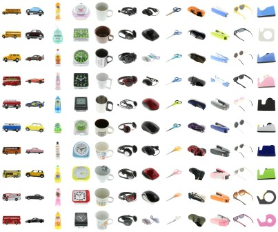

# MIRO: Multi-view Images of Rotated Objects

This is a dataset provided in our RotationNet paper.

Asako Kanezaki, Yasuyuki Matsushita and Yoshifumi Nishida.
**RotationNet: Joint Object Categorization and Pose Estimation Using Multiviews from Unsupervised Viewpoints.** 
*CVPR*, accepted, 2018.
([pdf](https://arxiv.org/abs/1603.06208))

### 1. [Download (414 MB)](https://data.airc.aist.go.jp/kanezaki.asako/data/MIRO.zip)
    $ wget https://data.airc.aist.go.jp/kanezaki.asako/data/MIRO.zip

### 2. Prepare dataset directories for RotationNet training
    $ unzip MIRO.zip  
    $ python prepare_MIRO_case1.py  
    $ python prepare_MIRO_case2.py  

